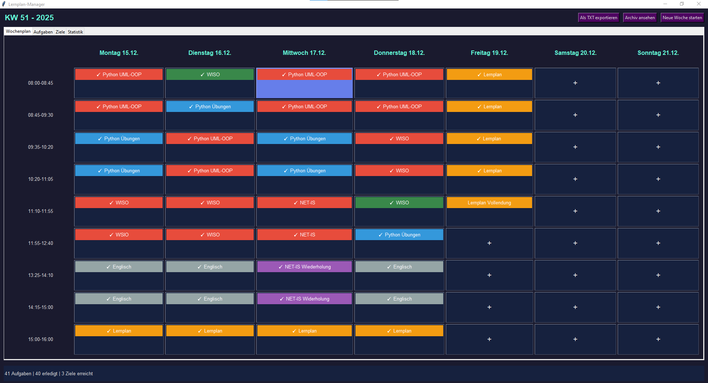
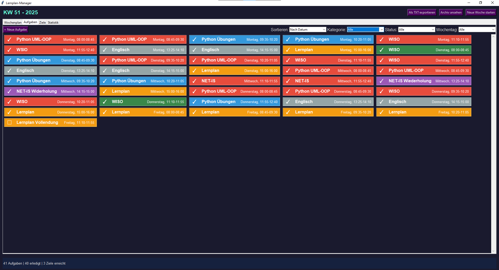
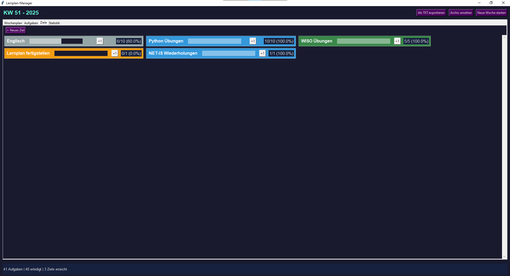
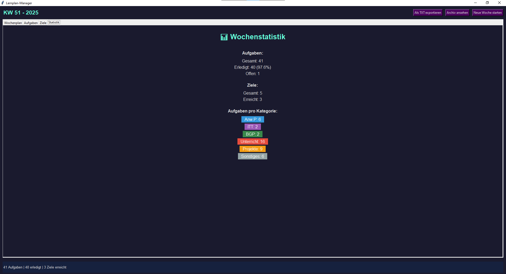

# 📅 Lernplan-Manager

Ein intelligentes Lern- und Zeitmanagement-Tool für Auszubildende, entwickelt mit Python und Tkinter.


<!-- Screenshot vom Hauptfenster einfügen -->


## 📖 Beschreibung

Der **Lernplan-Manager** ist eine Desktop-Anwendung zur Organisation des Lernalltags während der Ausbildung. Mit einem übersichtlichen Wochenplan, Aufgabenverwaltung und Ziel-Tracking behältst du den Überblick über deine Lernfortschritte.

Entwickelt im Rahmen meiner Umschulung zum Fachinformatiker für Anwendungsentwicklung.

## ✨ Features

### 📆 Wochenplan
- Kalender-Ansicht mit 45-Minuten-Zeitslots
- Wochentage mit aktuellem Datum
- Farbkodierung nach Kategorien
- Klick zum Hinzufügen neuer Aufgaben
- Linksklick zum Abhaken, Rechtsklick zum Bearbeiten/Löschen

### ✅ Aufgabenverwaltung
- Erstellen, Bearbeiten und Löschen von Aufgaben
- 6 Kategorien: Anw.P, ITT, BGP, Unterricht, Projekte, Sonstiges
- Filter nach Kategorie, Status und Wochentag
- Sortierung nach Datum oder Kategorie
- Dynamisches Mehrspalten-Layout

### 🎯 Wochenziele
- Ziele mit numerischem Fortschritt setzen
- Visueller Fortschrittsbalken
- +1 Button zum Incrementieren
- Prozentanzeige

### 📊 Statistiken
- Übersicht über Aufgaben und Ziele
- Erledigungsrate
- Aufgaben pro Kategorie

### 💾 Datenverwaltung
- Automatisches Speichern (JSON)
- Wochenarchiv für vergangene Wochen
- TXT-Export für Dokumentation

### ⌨️ Tastenkürzel
| Kürzel | Funktion |
|--------|----------|
| Ctrl+N | Neue Aufgabe |
| Ctrl+G | Neues Ziel |
| Ctrl+S | Manuell Speichern |
| Ctrl+E | Exportieren |

## 📸 Screenshots

<!-- Füge hier deine Screenshots ein -->

<details>
<summary>Wochenplan</summary>


</details>

<details>
<summary>Aufgaben-Liste</summary>



</details>

<details>
<summary>Ziele</summary>



</details>

<details>
<summary>Statistik</summary>



</details>

## 🚀 Installation

### Voraussetzungen
- Python 3.8 oder höher
- Tkinter (in den meisten Python-Installationen enthalten)

### Schritte

1. Repository klonen:
```bash
git clone https://github.com/rwarny/lernplan-manager.git
cd lernplan-manager
```

2. Programm starten:
```bash
python main.py
```

## 📁 Projektstruktur

```
lernplan_manager/
│
├── main.py                 # Einstiegspunkt
├── constants.py            # Konstanten, Kategorien, Farben
│
├── models/
│   ├── task.py            # Task-Klasse
│   └── goal.py            # Goal-Klasse
│
├── managers/
│   ├── week_manager.py    # Wochenverwaltung
│   └── storage.py         # JSON-Speicherung
│
├── ui/
│   ├── app.py             # Hauptfenster
│   ├── dialogs.py         # Dialoge für Tasks/Goals
│   ├── week_view.py       # Kalender-Ansicht
│   ├── task_view.py       # Aufgaben-Liste
│   ├── goal_view.py       # Ziele-Ansicht
│   └── stats_view.py      # Statistik-Ansicht
│
├── current_week.json      # Aktuelle Woche (wird erstellt)
└── archive/               # Archivierte Wochen
```

## 🛠️ Technologien

- **Python 3** - Programmiersprache
- **Tkinter** - GUI-Framework
- **JSON** - Datenspeicherung

## 📝 Verwendung

1. **Aufgabe erstellen**: Klicke auf einen Zeitslot im Wochenplan oder nutze "+ Neue Aufgabe"
2. **Aufgabe abhaken**: Linksklick auf die Aufgabe
3. **Aufgabe bearbeiten/löschen**: Rechtsklick auf die Aufgabe
4. **Ziel erstellen**: Im Tab "Ziele" auf "+ Neues Ziel" klicken
5. **Neue Woche starten**: "Neue Woche starten" archiviert die aktuelle Woche

## 🎓 Lernprojekt

Dieses Projekt wurde als Teil meiner Ausbildung zum **Fachinformatiker für Anwendungsentwicklung** entwickelt. 

### Gelernte Konzepte:
- Objektorientierte Programmierung (OOP)
- GUI-Entwicklung mit Tkinter
- Modulare Projektstruktur
- Datenpersistenz mit JSON
- Event-Handling und Callbacks

## 📄 Lizenz

Dieses Projekt ist unter der MIT-Lizenz lizenziert - siehe [LICENSE](LICENSE) für Details.

## 👤 Autor

**Rosy Warny**

- GitHub: [@rwarny](https://github.com/rwarny)
- LinkedIn: [Rosy Warny](https://www.linkedin.com/in/rosy-warny-22b665398/)

---

⭐ Wenn dir dieses Projekt gefällt, gib ihm einen Stern auf GitHub!
